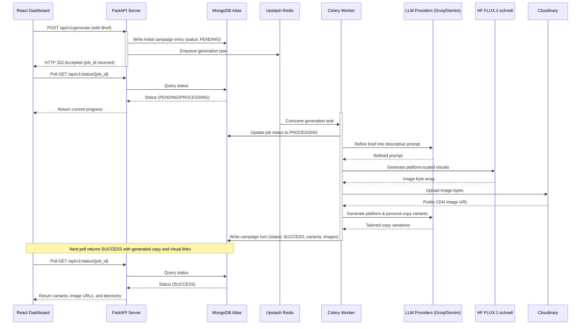

<!-- prettier-ignore -->
<div align="center">


# ViralGen AI

*Asynchronous multi-modal social media ad content generator*

[](https://www.python.org/)
[](https://fastapi.tiangolo.com/)
[](https://react.dev/)
[](https://docs.celeryq.dev/)
[](https://www.mongodb.com/)
[](https://redis.io/)

⭐ If you like this project, star it on GitHub!

[Features](#features) • [Tech Stack](#tech-stack) • [Architecture](#architecture) • [Getting Started](#getting-started) • [API Reference](#api-reference) • [Project Structure](#project-structure) • [Roadmap](#roadmap)

</div>

---

**ViralGen AI** is a production-grade, asynchronous marketing campaign generator designed to output high-velocity, multi-modal social media ad variations. Submit a simple brief, select your target channels and brand voices, and ViralGen AI handles prompt refinement, visual generation, copy creation, and persistence.

> [!NOTE]
> Marketing pipelines involving image and copy generation are slow and API-quota sensitive. ViralGen AI decouples request ingestion from execution using an asynchronous task queue, ensuring sub-200ms API response times while jobs process safely in the background.

---

## Features

- 🎯 **Prompt Refinement Agent** — Automatically intercepts raw briefs (e.g., *"running shoes"*) and expands them into rich, platform-tailored prompts specifying lighting, camera angles, and composition.
- 🎭 **Brand Voice Enforcement** — Restricts outputs to strict brand personas (`Professional` for B2B/LinkedIn, `Witty` for engaging content, and `Urgent` for high-impact CTAs) while blocking generic AI clichés.
- ⚡ **Asynchronous Pipeline** — Background worker orchestration for heavy workloads using Celery and Redis, allowing instant submission feedback and status polling.
- 🎨 **Platform-Specific Visuals** — Generates optimized images via Hugging Face's serverless Inference API (FLUX.1-schnell), matching target platform aspect ratios.
- 🔄 **Multi-Turn Conversational Refinement** — Allows progressive feedback loops to refine existing copy and images over multiple campaign "turns".
- 💾 **Reliable Storage & Hosting** — Media storage on Cloudinary coupled with long-term campaign tracking in MongoDB Atlas.

---

## Tech Stack

| Layer | Technology | Role |
| :--- | :--- | :--- |
| **API Framework** | FastAPI (Python 3.11+) | Asynchronous web layer handling route logic and validation |
| **Task Queue** | Celery + Upstash Redis | Asynchronous background execution and result brokerage |
| **Primary copy LLM** | Groq (Llama-4-Scout / Llama-3.3-70b) | Primary high-performance text generation |
| **Backup copy LLM** | Google Gemini 2.5 Flash | Failover copy LLM to prevent generation downtime |
| **Image Generation** | Hugging Face FLUX.1-schnell | Serverless text-to-image modeling |
| **Database** | MongoDB Atlas (Motor driver) | Fully async document persistence and campaign history |
| **Image Storage** | Cloudinary | Persistent CDN and hosting for generated campaign visuals |
| **Frontend** | React 19 + Vite | High-performance, modern dashboard interface |
| **Testing** | pytest + mocks | Unit, integration, and E2E testing without quota usage |

---

## Architecture

The request lifecycle is fully decoupled to provide a fast, non-blocking experience:



---

## Getting Started

### Prerequisites

- **Python 3.11+** installed
- **Node.js 20+** and npm installed
- Active accounts and credentials for **Groq**, **Google AI Studio**, **Hugging Face**, **Cloudinary**, **Upstash Redis**, and **MongoDB Atlas**

### Setup & Installation

1. **Clone the repository:**
   ```bash
   git clone <repository-url>
   cd viralgenai
   ```

2. **Set up the Python Virtual Environment:**
   ```bash
   python -m venv .venv
   # Windows:
   .venv\Scripts\activate
   # Unix/macOS:
   source .venv/bin/activate

   pip install -r requirements.txt
   ```

3. **Configure Environment Variables:**
   Create a `.env` file in the root directory:
   ```bash
   cp .env.example .env
   ```
   Fill in the required configurations:
   ```env
   # --- LLM Providers ---
   GROQ_API_KEY=your_groq_api_key
   GEMINI_API_KEY=your_gemini_api_key

   # --- Hugging Face ---
   HUGGINGFACE_API_TOKEN=your_huggingface_token

   # --- Cloudinary ---
   CLOUDINARY_CLOUD_NAME=your_cloud_name
   CLOUDINARY_API_KEY=your_api_key
   CLOUDINARY_API_SECRET=your_api_secret

   # --- Upstash Redis / Celery ---
   UPSTASH_REDIS_URL=redis_url
   UPSTASH_REDIS_TOKEN=redis_token
   CELERY_BROKER_URL=celery_broker_url

   # --- MongoDB Atlas ---
   MONGODB_URI=mongodb_uri
   ```

---

## Running the Application

### Backend API & Worker
Start the FastAPI server. In local/development environments, starting FastAPI will automatically boot the integrated Celery worker process for self-contained, easy execution:

```bash
uvicorn app.main:app --reload
```

> [!TIP]
> Once started, the API docs are accessible locally at [http://localhost:8000/docs](http://localhost:8000/docs).
>
> If you prefer running the Celery worker separately (e.g., in production), you can disable auto-spawning in your configuration and start the worker manually:
> ```bash
> # Unix/macOS
> celery -A app.celery_app worker --loglevel=info
> # Windows (development solo pool)
> celery -A app.celery_app worker --loglevel=info -P solo
> ```

### Frontend Dashboard
To run the React dashboard application:

```bash
cd frontend
npm install
npm run dev
```

Open [http://localhost:5173](http://localhost:5173) in your browser to interact with the dashboard.

---

## Running Tests

FastAPI routes, prompt refinement, LLM clients, task workers, and storage layers are covered by a suite of asynchronous tests utilizing mocks so no external API quota is consumed during validation.

To execute the test suite:
```bash
pytest
```

---

## API Reference

### 1. Submit Generation Job
Submit a marketing brief to kick off a multi-platform background campaign generation.

- **Endpoint:** `POST /api/v1/generate`
- **Headers:** `Content-Type: application/json`
- **Request Body:**
  ```json
  {
    "brief": "Modern minimalist white sneakers for runners",
    "platforms": ["instagram", "linkedin", "twitter"],
    "personas": ["professional", "witty"],
    "variants_count": 1
  }
  ```
- **Response** (`202 Accepted`):
  ```json
  {
    "job_id": "8a32b6e1-9cf2-4df7-bc0c-eeef14e1329c",
    "status": "PENDING",
    "message": "Job accepted. Poll /api/v1/status/{job_id} for updates."
  }
  ```

### 2. Poll Job Status
Retrieve the progress logs, generated copy, and visual URLs for a submitted job.

- **Endpoint:** `GET /api/v1/status/{job_id}`
- **Response** (`200 OK` on `SUCCESS`):
  ```json
  {
    "job_id": "8a32b6e1-9cf2-4df7-bc0c-eeef14e1329c",
    "status": "SUCCESS",
    "progress_log": [
      { "status": "PENDING", "message": "Pipeline started — running Prompt Refinement Agent.", "timestamp": "2026-06-30T12:00:00Z" },
      { "status": "PROCESSING", "message": "Generating visual for platform 'instagram' (1/2).", "timestamp": "2026-06-30T12:00:02Z" },
      { "status": "SUCCESS", "message": "All variants generated.", "timestamp": "2026-06-30T12:00:05Z" }
    ],
    "brief": "Modern minimalist white sneakers for runners",
    "refined_prompt": "High-fidelity studio photography of minimalist white running sneakers, neutral background, volumetric lighting...",
    "variants": [
      {
        "platform": "instagram",
        "persona": "witty",
        "copy_text": "Run hard. Look clean. No excuses.",
        "char_count": 31,
        "variant_index": 1,
        "image_url": "https://res.cloudinary.com/..."
      }
    ],
    "telemetry": {
      "llm_provider": "groq",
      "model": "llama-4-scout-17b-16e-instruct",
      "image_model": "FLUX.1-schnell",
      "total_duration_ms": 5200,
      "created_at": "2026-06-30T12:00:00Z"
    }
  }
  ```

### 3. Campaign History
Retrieve a list of the most recent campaigns.

- **Endpoint:** `GET /api/v1/history?limit=20`

### 4. Delete Campaign
Remove a campaign job and its associated logs from the database.

- **Endpoint:** `DELETE /api/v1/status/{job_id}`

### 5. Clear Redis Cache
Flush Redis cache and job brokers to clean up storage.

- **Endpoint:** `POST /api/v1/redis/clear`

---

## Project Structure

```
viralgenai/
├── app/
│   ├── main.py                # FastAPI entry point & lifespan setup
│   ├── config.py              # Settings loader & environment parser
│   ├── celery_app.py          # Celery configuration with Redis broker
│   ├── tasks.py               # Celery background pipeline definitions
│   ├── logger.py              # Structlog-based JSON logger
│   ├── models/
│   │   ├── request_models.py  # Pydantic schemas for route requests
│   │   └── response_models.py # Pydantic schemas for API outputs
│   ├── routers/
│   │   ├── generate.py        # POST /api/v1/generate route
│   │   └── status.py          # GET /history, /status/{id}, DELETE routes
│   └── services/
│       ├── llm_client.py      # LLM handler with failover fail-safe logic
│       ├── copy_generator.py  # platform x persona copy loop
│       ├── prompt_refiner.py  # Visual prompt expansion service
│       ├── image_generator.py # Hugging Face image client & verification
│       ├── cloudinary_storage.py # Cloudinary image uploader
│       └── job_store.py       # MongoDB client wrappers
├── frontend/                  # React dashboard
├── tests/                     # Unit and integration test suites
├── pytest.ini                 # Pytest configuration settings
└── requirements.txt           # Backend dependencies
```

---

## Roadmap

| Week | Focus | Description |
| :--- | :--- | :--- |
| **Week 1** | ✅ API & LLM Foundation | Core FastAPI setup, Groq LLM integration, failover Gemini adapter, and B2B/B2C copy models. |
| **Week 2** | ✅ Multi-Modal & Storage | FLUX.1 image generation, prompt refiner engine, PIL checks, and Cloudinary upload automation. |
| **Week 3** | ✅ Queue & Worker | Celery asynchronous worker setup, Upstash Redis broker integration, and polling APIs. |
| **Week 4** | ✅ Persistence & Multi-Turn | MongoDB Atlas integration, multi-turn conversational history loop, campaign history page, deletion and flush tasks. |
